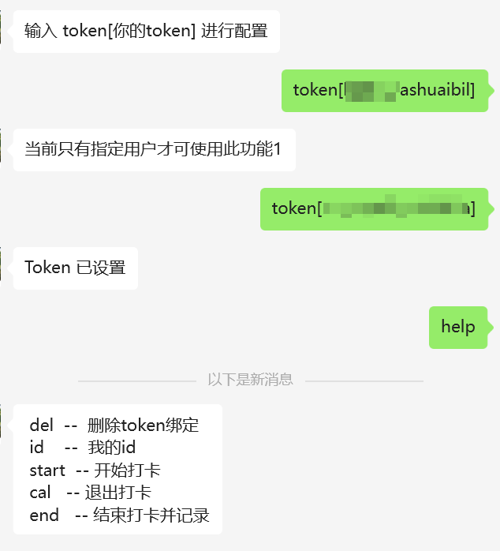

# Wechat-mark

每次吃到一家好吃的店，希望可以记录下位置，就使用微信公众号进行打卡记录，可以记录地理位置、图片、文字；
- 由于普通公众号的消息没有回话概念，因此使用 Redis 服务实现多轮次对话
- 使用 sqlite 存储打卡记录

# Road Map
- [x] 实现记录
- [ ] 实现检索展示


# requirements.txt
```
werkzeug==0.16.0
wechatpy==1.8.18
cryptography==36.0.1
sanic==19.12.5
redis==4.1.1
```

# 使用方式
## 1. 使用 docker 部署
### 已有 Redis 服务器的情况
```
# 在env.list中填写配置参数

docker run -d \
  -p 9000:9000 \
  --name wechat-mark \
  --env-file ~/.wechat-mark/env/env.list \
  -v ~/.wechat-mark/data:/data \
  singinger/wechat-mark

# 直接传入配置参数

docker run -d \
  -p 9000:9000 \
  --name wechat-mark \
  -e appid="" \
  -e token="" \
  -e encoding_aes_key="" \
  -e AppSecret="" \
  -e redisHost="" \
  -e redisPort="" \
  -e redisPassword="" \
  -e allowToken="" \
  -v ~/.wechat-mark/data:/data \
  singinger/wechat-mark

```
### 使用 docker-compose.yml 成套部署
```

```

## 2. 直接使用
```
git pull https://github.com/yylqing/wechat-mark
cd wechat-mark
vim .env
pip install -r requirements.txt -t .
python -u index.py
```

# 目录结构

文件存储结构
```
~/.wechat-mark
├── data
│   ├── ass
│   │   └── o1XDp0-XXXXXXXXXXXXXXXXXX
│   │       ├── 1701766922.jpeg
│   │       ├── 1701766923.jpeg
│   │       └── 1701775667.jpeg
│   └── db
│       └── mark.db
└── env
    └── env.list
```

# 环境变量
```
--- 微信公众号配置
appid=
token=
encoding_aes_key=
AppSecret=

--- Redis 配置
redisHost=
redisPort=
redisPassword=

--- 通过token来验证可以接入的用户（给有需要的人）
allowToken=
```

# 致谢
程序修改自： [neno-wx](https://github.com/openneno/neno-wx)

# 微信公众号配置

在公众号的基本配置页面可以找到公众号开发信息,公众号的开发者ID`appid`、公众号的开发者密码`AppSecret`。

服务器配置

1. 填写服务器地址(URL)，域名为 `www.example.com`,那么填写`http://www.example.com/wx-mark`,配置了https就填写`https://www.example.com/wx-mark`

2. 填写令牌(Token)

3. 填写消息加解密密钥(EncodingAESKey),使用自动生成功能即可
   
   token和消息加解密密钥(EncodingAESKey)都是需要填写到环境变量当中的。

4. 消息加解密方式选择安全模式

5. 点击提交，提示提交成功，即可在你的公众号中发消息进行测试。


# 使用方法
```
 token[allowToken]  -- 绑定token，开始使用
 del  --  删除token绑定 
 id    --  我的id 
 start  -- 开始打卡 
 cal   -- 退出打卡 
 end   -- 结束打卡并记录
 help  -- 查看帮助
```

